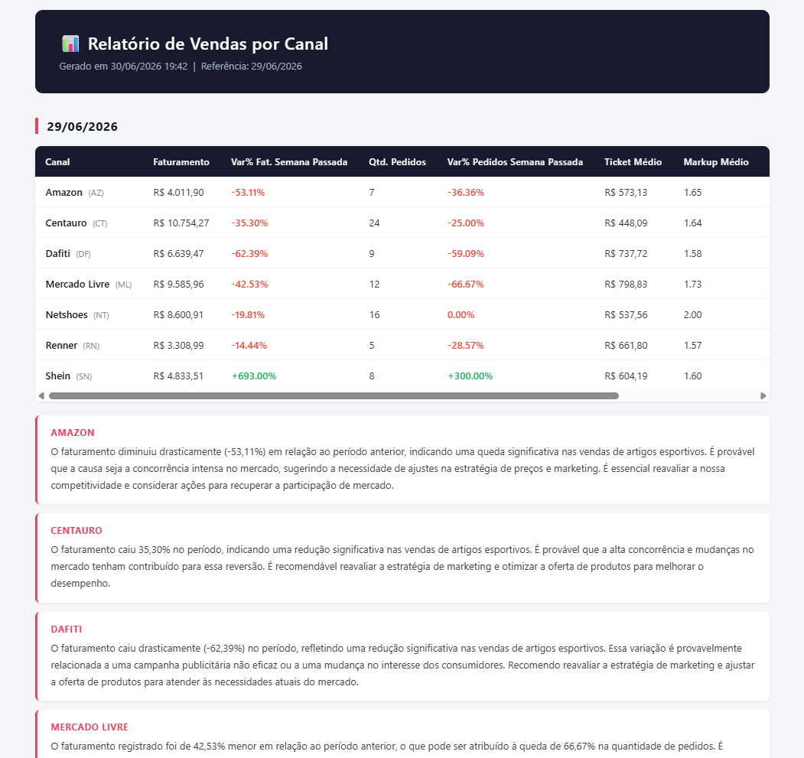

# Mala Direta E-commerce — Relatório Diário Automatizado

Pipeline de automação que gera e envia, todos os dias, um relatório executivo de vendas por canal para a gerência e analistas comerciais de um e-commerce de artigos esportivos.

## Contexto de negócio

Em muitos e-commerces, a extração de dados de vendas ainda é feita manualmente a partir do ERP, em planilhas Excel. A consolidação desses dados, o cálculo de indicadores e a análise comparativa costumam ser feitos manualmente todos os dias — um processo repetitivo e propenso a erros.

Este projeto automatiza esse fluxo: a partir de uma planilha exportada do ERP, o pipeline consolida o histórico, calcula os indicadores comerciais por canal de venda, gera insights interpretativos com IA e envia um relatório por e-mail, sem necessidade de intervenção manual além da extração inicial dos dados.

**Regra de negócio principal — D-1:**
- Terça a sexta-feira: o relatório traz os dados do dia anterior (D-1).
- Segunda-feira: o relatório consolida sexta, sábado e domingo separadamente, além de uma coluna de "Final de Semana" (soma de sábado + domingo) — período que normalmente fica sem cobertura em relatórios diários simples.

## Arquitetura do pipeline

Excel (export do ERP)
│
▼
data/incoming/  ──► Validação e limpeza (Pandas)
│
▼
SQLite (histórico consolidado)
│
▼
Cálculo de KPIs por canal de venda
│
▼
Comparação com mesmo período da semana anterior
│
▼
Insights automáticos via IA (Groq — Llama 3.1)
│
▼
Relatório HTML (Jinja2)
│
▼
Envio automático por e-mail (SMTP)

## KPIs calculados por canal

Cada canal de venda (Centauro, Mercado Livre, Dafiti, Netshoes, Amazon, Renner e Shein) é analisado individualmente, com:

- Faturamento
- Quantidade de pedidos
- Variação % vs. mesmo período da semana anterior
- Ticket médio
- Produto mais vendido
- Markup médio
- Margem de contribuição
- Insight executivo gerado por IA, interpretando os números acima

## Stack utilizada

| Camada | Tecnologia |
|---|---|
| Geração de dados simulados | Python, Faker, Pandas |
| ETL e validação | Pandas |
| Persistência | SQLite |
| Análise e KPIs | Pandas, SQL |
| Geração de insights | API Groq (Llama 3.1 8B Instant) |
| Geração do relatório | Jinja2 (HTML) |
| Envio de e-mail | smtplib (SMTP) |
| Orquestração | Script Python (`run_pipeline.py`) |

## Estrutura do Projeto

```text
mala-direta-ecommerce/
├── data/
│   ├── incoming/          # planilha de entrada (export do ERP)
│   ├── processed/         # arquivos já processados
│   └── database/          # banco SQLite
├── src/
│   ├── generate_dataset.py   # gera dataset simulado com Faker
│   ├── etl.py                 # valida, limpa e carrega no banco
│   ├── analysis.py            # calcula KPIs e aplica regra D-1/segunda
│   ├── ai_insights.py         # gera insights via IA (Groq)
│   ├── report.py              # monta o relatório HTML
│   └── email_sender.py        # envia o relatório por e-mail
├── templates/
├── output/
│   └── reports/           # relatórios HTML gerados
├── logs/                  # logs de execução
├── run_pipeline.py        # orquestrador do pipeline completo
└── .env                   # credenciais (não versionado)
```

## Como executar

### 1. Instalar dependências
```bash
pip install pandas faker openpyxl numpy groq python-dotenv jinja2
```

### 2. Configurar variáveis de ambiente
Crie um arquivo `.env` na raiz do projeto:

- GROQ_API_KEY=sua-chave-groq
- EMAIL_REMETENTE=seuemail@gmail.com
- EMAIL_SENHA=sua-senha-de-app
- EMAIL_SMTP=smtp.gmail.com
- EMAIL_PORTA=numero da porta
- EMAIL_DESTINATARIOS=destinatario1@email.com,destinatario2@email.com

### 3. Rodar o pipeline completo
```bash
python run_pipeline.py
```

### Flags disponíveis
```bash
python run_pipeline.py --skip-dataset   # não gera novo dataset simulado
python run_pipeline.py --skip-etl       # não recarrega o banco
python run_pipeline.py --skip-ai        # pula a geração de insights
python run_pipeline.py --skip-email     # gera o relatório sem enviar e-mail
python run_pipeline.py --only-dataset   # apenas gera o dataset
python run_pipeline.py --only-etl       # apenas roda o ETL
```

## Relatório


